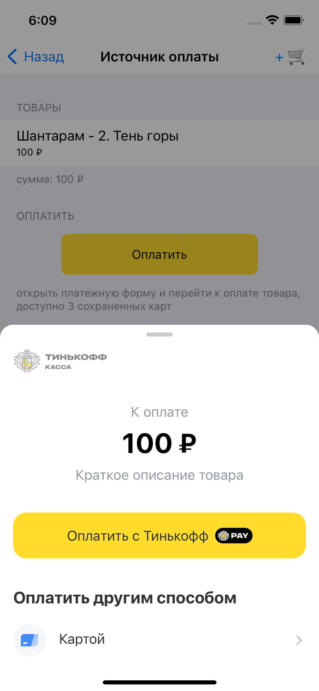
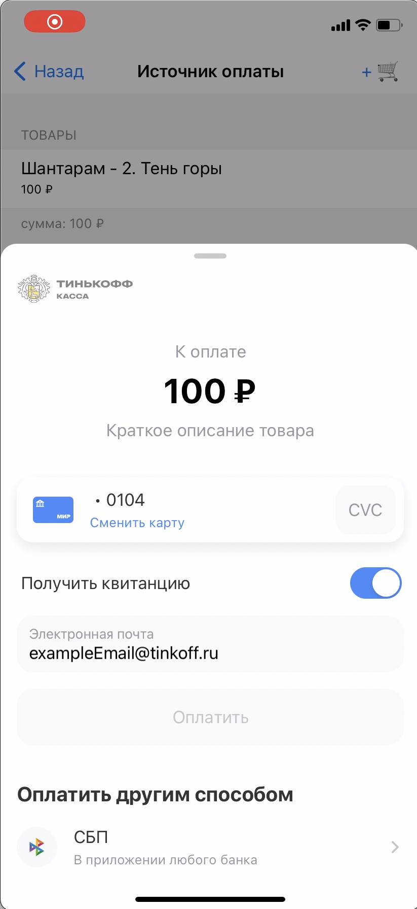
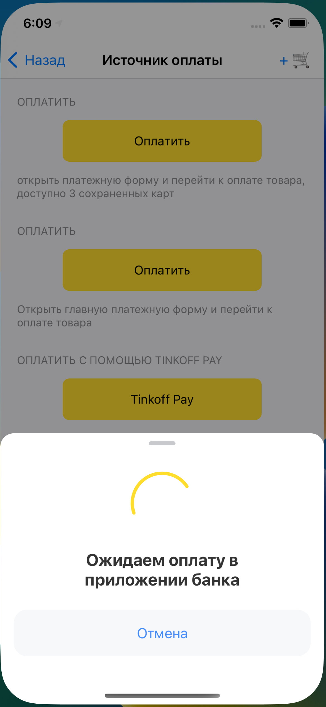
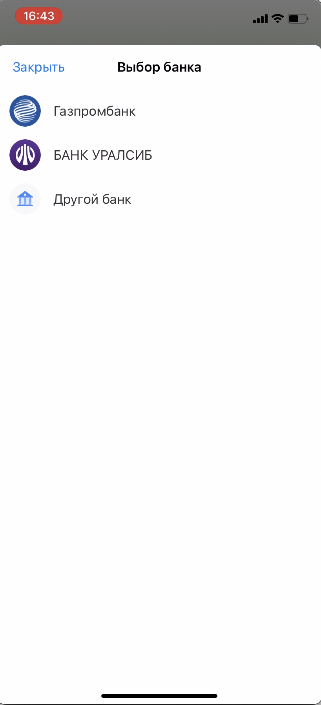
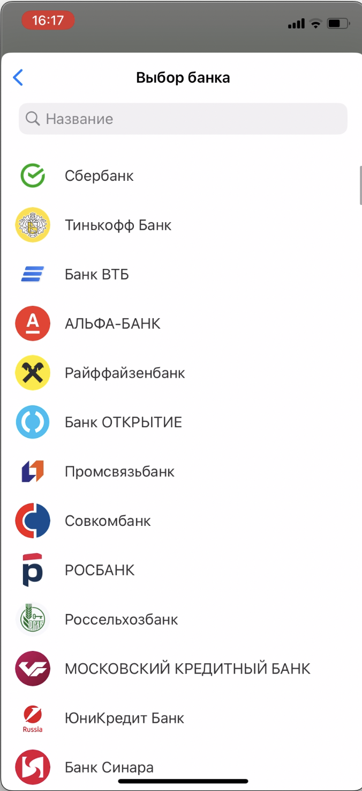
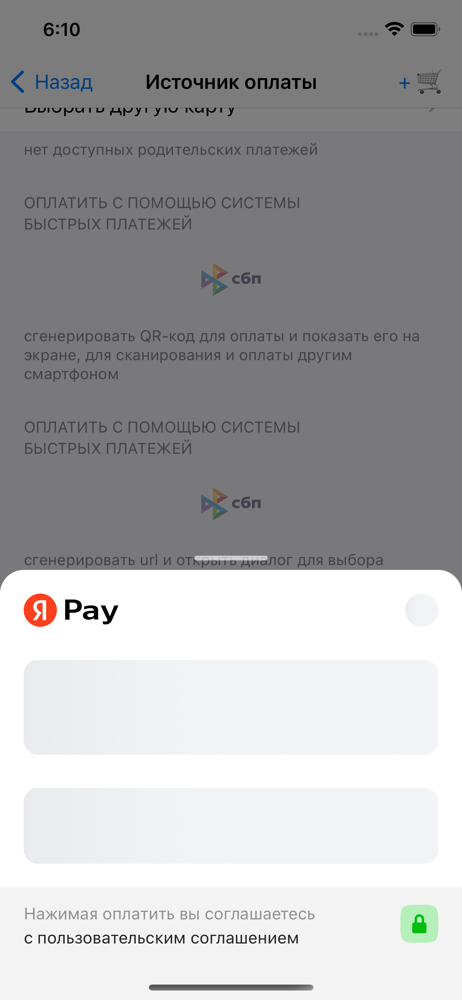
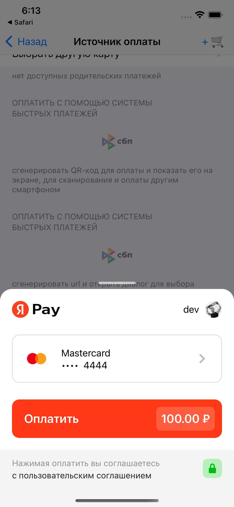
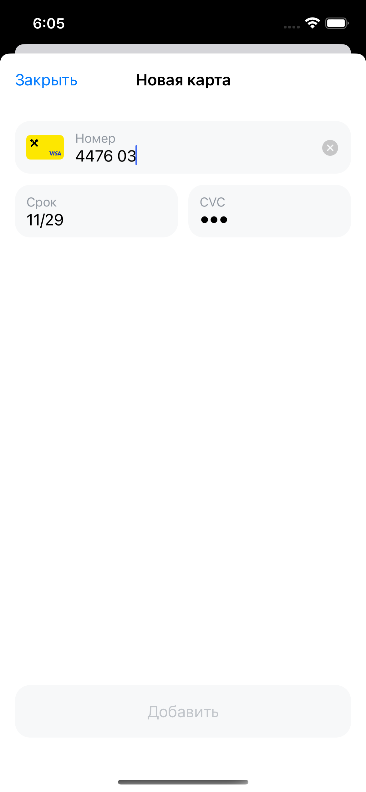
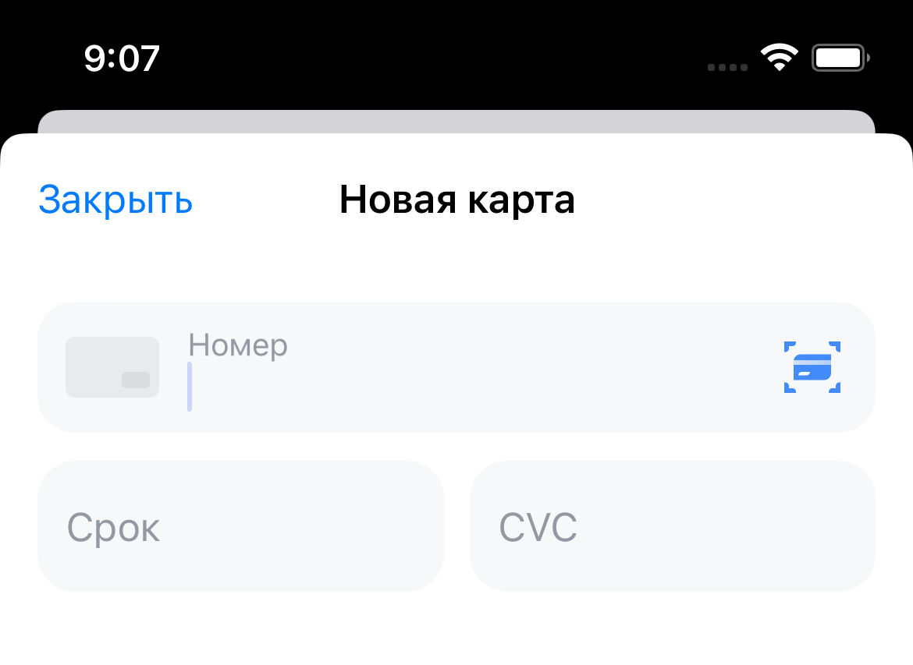

# Tinkoff Acquiring SDK for iOS

Acquiring SDK позволяет интегрировать Интернет-Эквайринг в мобильные приложения для платформы iOS.

- [Модули](#модули)
- [Подключение](#подключение)
  - [Cocoapods](#cocoapods)
  - [Swift Package Manager](#swift-package-manager)
- [Требования и ограничения](#требования-и-ограничения)
- [Подготовка к работе](#подготовка-к-работе)
  - [Обеспечение работы с SSL/TLC сертификатами Минцифры](#обеспечение-работы-с-ssltlc-сертификатами-минцифры)
  - [Инициализация SDK](#инициализация-sdk)
  - [Подпись запросов с помощью токена](#подпись-запросов-с-помощью-токена)
- [Совершение платежей](#совершение-платежей)
  - [Формирование данных об оплате](#формирование-данных-об-оплате)
  - [Получение результата оплаты](#получение-результата-оплаты)
  - [Оплата с помощью платежной формы](#оплата-с-помощью-платежной-формы)
  - [Оплата с помощью TinkoffPay](#оплата-с-помощью-tinkoffpay)
  - [Оплата с помощью Системы быстрых платежей](#оплата-с-помощью-системы-быстрых-платежей)
  - [Оплата с помощью QR-кода Системы быстрых платежей](#оплата-с-помощью-qr-кода-системы-быстрых-платежей)
  - [Рекуррентный платеж](#рекуррентный-платеж)
  - [Оплата с помощью YandexPay](#оплата-с-помощью-yandexpay)
- [Управление банковскими картами](#управление-банковскими-картами)
  - [Список сохраненных карт](#список-сохраненных-карт)
  - [Привязка новой карты](#привязка-новой-карты)
- [Дополнительные возможности](#дополнительные-возможности)
  - [Сканирование карт](#сканирование-карт)
- [Поддержка](#поддержка)

## Модули

Acquiring SDK состоит из трех модулей, которые можно подключать в ваше приложение по необходимости:

- **TinkoffASDKCore** - низкоуровневый модуль, используемый для формирования и совершения сетевых запросов к [API эквайринга][redoc], а также для конфигурации безопасной передачи данных в сети
- **TinkoffASDKUI** - содержит всю необходимую логику для интеграции различных пользовательских сценариев по приему платежей в ваше приложение. В большинстве ситуаций вам достаточно подключить только его
- **TinkoffASDKYandexPay** - вспомогательный модуль, инкапсулирующий всю работу с [YandexPaySDK][yandex-pay-docs]. Подключайте его, если необходимо интегрировать кнопку `YandexPay`, настроенную на прием платежей с помощью [интернет-эквайринга Тинькофф Касса][acquiring]

## Подключение

### Cocoapods

Для подключения с помощью `Cocoapods` добавьте в файл `Podfile` необходимые для ваших целей зависимости:

```ruby
pod 'TinkoffASDKCore'
pod 'TinkoffASDKUI'
pod 'TinkoffASDKYandexPay'
```

### Swift Package Manager

#### Используя `Package.swift`

Чтобы интегрировать AcquiringSdk в ваш проект используя `Package.swift` нужно указать зависимость:

```swift
dependencies: [
  .package(url: "https://github.com/tinkoff-mobile-tech/AcquiringSdk_IOS.git", .upToNextMajor(from: "3.0.0"))
]
```

#### Через Xcode

File -> Add packages -> `https://github.com/tinkoff-mobile-tech/AcquiringSdk_IOS`

Выберите нужные модули:

![spm-products][img-spm-products]

## Требования и ограничения

Для работы Tinkoff Acquiring SDK необходимо:

- Поддержка iOS 12.3 и выше
- Минимальная версия Swift - 5.7 (Xcode 14.0)

## Подготовка к работе

Для начала работы с SDK вам понадобятся:

- **TerminalKey** - Идентификатор терминала Продавца
- **PublicKey** – публичный ключ, используемый для шифрования данных

Данные выдаются в личном кабинете после подключения к [Интернет-Эквайрингу][acquiring].

Подробнее о настройке Личного кабинета можно прочитать [тут](./Docs/PersonalAccountSettings.md)

### Обеспечение работы с SSL/TLC сертификатами Минцифры

На случай отзыва глобальных сертификатов в SDK предусмотрена возможность перехода на сертификаты, выданные `Министерством цифрового развития`.

> :warning: **Крайне важно адаптировать свой проект по инструкции ниже. В противном случае ваше приложение не сможет принимать оплату в случае внезапного отзыва сертификатов**

Для корректной работы с сертификатами `Минцифры`, необходимо добавить в `Info.plist` свойство `App Transport Security Settings` c флагом `Allow Arbitrary Loads = true`

Можно просто скопировать `source code` и вставить в `Info.plist`:

```xml
<key>NSAppTransportSecurity</key>
<dict>
    <key>NSAllowsArbitraryLoads</key>
    <true/>
</dict>
```

Если в вашем приложении используется `Allow Arbitrary Loads` для конкретных доменов,
то следует добавить несколько наших доменов (`rest-api-test.tinkoff.ru` - тестовый домен, опционально) и указать свойство `Allow Arbitrary Loads in Web Content = true`:

```xml
<key>NSAppTransportSecurity</key>
<dict>
    <key>NSAllowsArbitraryLoads</key>
    <false/>
    <key>NSExceptionDomains</key>
    <dict>
        <key>qr.nspk.ru</key>
        <dict>
            <key>NSExceptionAllowsInsecureHTTPLoads</key>
            <true/>
            <key>NSIncludesSubdomains</key>
            <true/>
        </dict>
        <key>rest-api-test.tinkoff.ru</key>
        <dict>
            <key>NSExceptionAllowsInsecureHTTPLoads</key>
            <true/>
            <key>NSIncludesSubdomains</key>
            <true/>
        </dict>
        <key>securepay.tinkoff.ru</key>
        <dict>
            <key>NSExceptionAllowsInsecureHTTPLoads</key>
            <true/>
            <key>NSIncludesSubdomains</key>
            <true/>
        </dict>
    </dict>
    <key>NSAllowsArbitraryLoadsInWebContent</key>
    <true/>
</dict>
```

### Инициализация SDK

Для инциализации SDK прежде всего необходимо создать конфигурацию, а после передать ее в `init`. Ниже приведен пример с минимально необходимыми параметрами:

```swift
import TinkoffASDKCore
import TinkoffASDKUI 

let credential = AcquiringSdkCredential(
    terminalKey: "TERMINAL_KEY",
    publicKey: "PUBLIC_KEY"
)

let coreSDKConfiguration = AcquiringSdkConfiguration(
    credential: credential,
    server: .prod // Используемое окружение
)

let uiSDKConfiguration = UISDKConfiguration()

do {
    let sdk = try AcquiringUISDK(
        coreSDKConfiguration: coreSDKConfiguration,
        uiSDKConfiguration: uiSDKConfiguration
    )
} catch {
    // Ошибка может возникнуть при некорректном параметре `publicKey`
    assertionFailure("\(error)")
}
```

#### Дополнительные параметры в AcquiringSdkConfiguration

- **logger: ILogger?** - Интерфейс для логирования работы сетевого слоя. Вы можете передать сюда реализацию по умолчанию - `Logger`, форматирующую и выводящую данные в консоль
- **language** - язык, на котором сервер будет присылать тексты ошибок. Эти сообщения никогда не отображаются пользователю и используются исключительно для отладки
- **requestsTimeoutInterval: TimeInterval** - таймаут сетевых запросов. Значение по-умолчанию - 40 секунд 
- **tokenProvider**: **ITokenProvider?** - протокол, предоставляющий токен для подписи запроса в API эквайринга. Необходим только для терминалов, с включенной проверкой токена. [Подробнее](#подпись-запросов-с-помощью-токена)
- **urlSessionAuthChallengeService: IURLSessionAuthChallengeService?** - Интерфейс для запроса данных и способах аутентификации `URLSession`. Не рекомендуется бездумно передавать сюда что-либо, поскольку используемая по-умолчанию реализация обеспечит корректное взаимодействие с сервером, в случае перехода на SSL/TLC сертификаты `Минцифры`. [Подробнее](#обеспечение-работы-с-ssltlc-сертификатами-минцифры)

#### Дополнительные параметры в UISDKConfiguration

- **webViewAuthChallengeService: IWebViewAuthChallengeService?** - Интерфейс для запроса данных и способах аутентификации `WKWebView`. Не рекомендуется бездумно передавать сюда что-либо, поскольку используемая по-умолчанию реализация обеспечит корректное взаимодействие с сервером, в случае перехода на SSL/TLC сертификаты `Минцифры`. [Подробнее](#обеспечение-работы-с-ssltlc-сертификатами-минцифры)
- **paymentStatusRetriesCount: Int** - Отвечает за максимальное количество запросов на обновление статуса платежа. Используется для того, чтобы получить конечный статус после того, как пользователь совершил оплату. Можно установить любое положительное значение. По умолчанию используется 10 попыток получить конечный статус с интервалом в 3 секунда
- **addCardCheckType: PaymentCardCheckType** - Тип проверки при привязке карты. По умолчанию - `.no`. [Подробнее][redoc-check-type]

### Подпись запросов с помощью токена

Если ваш терминал поддерживает валидацию токена, отправляемого в запросах к API эквайринга, то необходимо реализовать протокол `ITokenProvider` и передать его в `AcquiringSdkConfiguration`:

```swift
func provideToken(
  forRequestParameters parameters: [String: String], // Параметры, участвующие в генерации токена
  completion: @escaping (Result<String, Error>) -> Void // Замыкание, которое необходимо вызвать, передав результат генерации токена
)
```

Для генерации токена необходимо:

- Добавить пароль от терминала в словарь с ключом `Password`
- Отсортировать пары ключ-значение по ключам в алфавитном порядке
- Конкатенировать значения всех пар
- Для полученной строки вычислить хэш SHA-256

[Подробнее о подписи запроса][acquiring-request-sign]

#### Пример

В простейшем случае реализация может выглядеть следующим образом:

```swift
import TinkoffASDKCore

func provideToken(
  forRequestParameters parameters: [String: String],
  completion: @escaping (Result<String, Error>) -> Void
) {
  let sourceString = parameters
    .merging(["Password": password]) { $1 }
    .sorted { $0.key < $1.key }
    .map(\.value)
    .joined()

  let hashingResult = Result {
    try SHA256.hash(from: sourceString)
  }

  completion(hashingResult)
}
```

> :warning: **Реализация выше приведена исключительно в качестве примера**. В целях  безопасности не стоит хранить и как бы то ни было взаимодействовать с паролем от терминала в коде мобильного приложения. Наиболее подходящий сценарий - передавать полученные параметры на сервер, где будет происходить генерация токена на основе параметров и пароля

## Совершение платежей

Всякое взаимодействие с различными пользовательскими сценариями оплаты происходит через единый фасад `AcquiringUISDK`. Пример его инициализации можно увидеть в [разделе выше](#инициализация-sdk).

В SDK реализованы как отдельные точки входа для каждого сценария оплаты, так и общая платежная форма, содержащая в себе несколько видов оплаты, доступных на данном терминале.

### Формирование данных об оплате

Для того, чтобы совершить платеж, необходимо создать объект `PaymentFlow` и передать его в соответствующую функцию `AcquiringUISDK`.

`PaymentFlow` представляет из себя `enum`, указывающий на конкретный вид проведения оплаты. Используется во всех сценариях оплаты в SDK:

```swift
/// Тип проведения оплаты
public enum PaymentFlow: Equatable {
    /// Оплата совершится с помощью вызова `v2/Init` в API эквайринга, на основе которого будет сформирован `paymentId`
    case full(paymentOptions: PaymentOptions)
    /// Используется в ситуациях, когда вызов `v2/Init` и формирование `paymentId` происходит на бекенде продавца
    case finish(paymentOptions: FinishPaymentOptions)
}
```

Подобное разделение позволяет использовать SDK как в приложениях, где логика по формированию платежных данных реализована на клиенте, так и в приложениях, где эта работа происходит на сервере.

Ниже рассмотрим формирование параметров для каждого кейса.

#### Full payment

Здесь клиентское приложение предоставляет все необходимы данные, участвующие в проведении платежа. SDK самостоятельно инициирует и завершает платеж.

Для создания `PaymentFlow` с типом `.full`, необходимо передать параметры платежа с помощью `PaymentOptions`:

```swift
let receipt: Receipt
let shops: [Shop]
let receipts: [Receipt]

let orderOptions = OrderOptions(
    /// Идентификатор заказа в системе продавца
    orderId: "ORDER_ID",
    // Полная сумма заказа в копейках
    amount: 100000,
    // Краткое описание заказа
    description: "DESCRIPTION",
    // Данные чека
    receipt: receipt,
    // Данные маркетплейса. Используется для разбивки платежа по партнерам
    shops: shops,
    // Чеки для каждого объекта в `shops`.
    // В каждом чеке необходимо указывать `Receipt.shopCode` == `Shop.shopCode`
    receipts: receipts,
    // Сохранить платеж в качестве родительского
    savingAsParentPayment: false
)

let customerOptions = CustomerOptions(
    // Идентификатор покупателя в системе продавца. 
    // С помощью него можно привязать карту покупателя к терминалу после успешного платежа 
    customerKey: "CUSTOMER_KEY",
    // Email покупателя
    email: "EMAIL"
)

// Используется для редиректа в приложение после успешного или неуспешного совершения оплаты с помощью `TinkoffPay`
// В иных сценариях передавать эти данные нет необходимости
let paymentCallbackURL = PaymentCallbackURL(
    successURL: "SUCCESS_URL",
    failureURL: "FAIL_URL"
)

// Словарь, содержащий дополнительные параметры в виде `[Key: Value]`, которые можно передать по необходимости
let paymentData = ["someKey": "someValue"]

let paymentOptions = PaymentOptions(
    orderOptions: orderOptions,
    customerOptions: customerOptions,
    paymentCallbackURL: paymentCallbackURL,
    paymentData: paymentData
)

let paymentFlow: PaymentFlow = .full(paymentOptions: paymentOptions)
```

Все эти данные могут использоваться для инициации платежа с помощью метода `v2/Init`. Подробнее можно ознакомиться [тут][redoc-init]

#### Finish payment

Здесь клиентское приложение предоставляет минимальный набор данных для завершения платежа при условии, что платеж был инициирован ранее за пределами SDK:

```swift
// Идентификатор платежа, полученный при вызове `v2/Init`
let paymentId: String 

let finishOptions = FinishPaymentOptions(
    paymentId: paymentId,
    amount: 100000,
    orderId: "ORDER_ID",
    customerOptions: customerOptions
)

let paymentFlow: PaymentFlow = .finish(paymentOptions: finishOptions)
```

### Получение результата оплаты

При всех сценариях платежей в `Acquiring SDK` результат выполненной работы возвращается с помощью замыкания, вызываемого сразу после закрытия экрана оплаты:

```swift
/// Замыкание с результатом, вызываемое после закрытия экрана оплаты
public typealias PaymentResultCompletion = (PaymentResult) -> Void
```

Здесь `PaymentResult` представляет из себя `enum` с тремя возможными кейсами:

```swift
/// Результат платежа
public enum PaymentResult {
    /// Успешное завершение оплаты
    case succeeded(PaymentInfo)
    /// Произошла ошибка на этапе оплаты
    case failed(Error)
    /// Оплата отменена пользователем
    case cancelled(PaymentInfo? = nil)
}
```

В `PaymentInfo` находится дополнительная информация о совершенной оплате:

```swift
/// Информация о проведенном платеже
public struct PaymentInfo {
    /// Идентификатор платежа
    public let paymentId: String
    /// Идентификатор заказа в системе продавца
    public let orderId: String
    /// Сумма заказа в копейках
    public let amount: Int64
    // Последний детальный статус о платеже
    public let paymentStatus: AcquiringStatus
}
```

`PaymentInfo` так же может располагаться и в `cancelled` в тех ситуациях, когда SDK начал процесс оплаты, но пользователь закрыл экран, не дождавшись завершения работы.

### Оплата с помощью платежной формы
<p align="center">
  <kbd>
    
    
  </kbd>
<p/>

В SDK реализована общая платежная форма. В ней отображаются несколько способов оплаты, доступных для данного терминала, и пользователь может выбрать любой из них:

- **Оплата по новой карте**
- **Оплата по сохраненной карте**
- **TinkoffPay**
- **Система быстрых платежей**

> :warning: **Для корректной работы TinkoffPay и СБП необходимо дополнительно сконфигурировать ваш проект, поэтому ознакомьтесь с описанием этих способов оплаты ниже**.

Для отображения платежной формы необходимо вызвать соответствующую функцию в `AcquiringUISDK`:

```swift
/// Отображает основную платежную форму с различными способами оплаты
/// - Parameters:
///   - presentingViewController: `UIViewController`, поверх которого отобразится платежная форма
///   - paymentFlow: Содержит тип платежа и параметры оплаты
///   - configuration: Конфигурация платежной формы
///   - cardScannerDelegate: Делегат, предоставляющий возможность отобразить карточный сканер поверх заданного экрана
///   - completion: Замыкание с результатом, вызываемое после закрытия экрана оплаты
public func presentMainForm(
    on presentingViewController: UIViewController,
    paymentFlow: PaymentFlow,
    configuration: MainFormUIConfiguration,
    cardScannerDelegate: ICardScannerDelegate? = nil,
    completion: PaymentResultCompletion? = nil
)
```

С помощью объекта `MainFormConfiguration` можно задать дополнительную конфигурацию платежной формы:

```swift
/// Конфигурация главной платежной формы
///
/// На основе этих данный будет формироваться отображение UI платежной формы с разными способами оплаты
public struct MainFormUIConfiguration {
  /// Очень краткое описание заказа, отображаемое пользователю
  public let orderDescription: String?
}
```

Также вы можете передать, ссылку на реализацию [ICardScannerDelegate](#сканирование-карт), с помощью которой пользователь сможет отсканировать свою банковскую карту.

Платежная форма закроется по завершении оплаты и вернет в `completion` объект `PaymentResult`

### Оплата с помощью TinkoffPay
<p align="center">
  <kbd>
    
  </kbd>
<p/>

Прежде всего для корректной работы `TinkoffPay` в вашем приложении необходимо добавить в `Info.plist` в массив по ключу `LSApplicationQueriesSchemes` значение `tinkoffbank`:

```xml
<key>LSApplicationQueriesSchemes</key>
<array>
  <string>tinkoffbank</string>
</array>
```

Благодаря этому SDK сможет корректно определить наличие приложения `Тинькофф` на устройстве пользователя.

Для отображения экрана оплаты `TinkoffPay` необходимо вызвать соответствующую функцию в `AcquiringUISDK`:

```swift
/// Отображает экран оплаты `TinkoffPay`
/// - Parameters:
///   - presentingViewController: `UIViewController`, поверх которого будет отображен экран оплаты `TinkoffPay`
///   - paymentFlow: Содержит тип платежа и параметры оплаты
///   - completion: Замыкание с результатом оплаты, вызываемое после закрытия экрана `TinkoffPay`
public func presentTinkoffPay(
    on presentingViewController: UIViewController,
    paymentFlow: PaymentFlow,
    completion: PaymentResultCompletion? = nil
)
```

При наличии у пользователя установленного приложения `Тинькофф` SDK совершит переход в него.

Экран закроется по завершении оплаты и вернет в `completion` объект `PaymentResult`

Оплата с помощью `TinkoffPay` также доступа с [платежной формы](#оплата-с-помощью-платежной-формы)

### Оплата с помощью Системы быстрых платежей

<p align="center">
  <kbd>
    
    
  </kbd>
<p/>

В SDK доступны несколько видов оплаты с помощью `СБП`. В данном разделе описан сценарий, при котором пользователю отображается список банков, поддерживающих оплату `СБП`. При выборе конкретного банка из списка произойдет переход в соответствующее банковское приложение.

Для получения списка доступных банков SDK отправляет запрос в [НСПК][nspk-sbp] и получает в ответ `JSON` со списком URL-схем банковских приложений:

```json
{
  "version": "1.0",
  "dictionary": [
    {                
      "bankName": "Сбербанк",
      "logoURL": "https://qr.nspk.ru/proxyapp/logo/bank100000000111.png",
      "schema": "bank100000000111",
      "package_name": "ru.sberbankmobile"
    },
    {
      "bankName": "Тинькофф Банк",
      "logoURL": "https://qr.nspk.ru/proxyapp/logo/bank100000000004.png",
      "schema": "bank100000000004",
      "package_name": "com.idamob.tinkoff.android"
    },
    {                
      "bankName": "Банк ВТБ",
      "logoURL": "https://qr.nspk.ru/proxyapp/logo/bank100000000005.png",
      "schema": "bank110000000005",
      "package_name": "ru.vtb24.mobilebanking.android"                  
    }
  ]
}
```

Поскольку список содержит более сотни банков, для удобства SDK отображает в первую очередь именно те, что достоверно установлены на устройстве пользователя. Для этого этого мы формируем `URL` на основе значения в `schema` и вызываем системную функцию [canOpenURL(:)][apple-can-open-url].

Согласно [документации][apple-can-open-url-discussion], данный метод возвращает корректный ответ только при внесении схемы в массив с ключом `LSApplicationQueriesSchemes` в `Info.plist`. Также там сказано, что в этот список вы можете внести не более 50 схем.

Именно поэтому для корректного отображения списка банков вам необходимо выбрать наиболее приоритетные для вас банковские приложения, которые в первую очередь будут отображаться на экране банков СБП, и внести их в `Info.plist`:

```xml
<key>LSApplicationQueriesSchemes</key>
<array>
  <string>bank100000000111</string>
  <string>bank100000000004</string>
  <string>bank110000000005</string>
  <string>bank100000000008</string>
</array>
```

> :warning: **В связи с блокировками банковских приложений в AppStore схемы могут меняться. Вам необходимо периодически сверяться со [списком][nspk-sbp] и актуализировать Info.plist своего приложения**

Для отображения экрана со списком банков `СБП` вызовите в `AcquiringUISDK` функцию:

```swift
/// Отображает экран со списком приложений банков, с помощью которых можно провести оплату через `Систему быстрых платежей`
/// - Parameters:
///   - presentingViewController: `UIViewController`, поверх которого будет отображен экран со списком банков
///   - paymentFlow: Содержит тип платежа и параметры оплаты
///   - completion: Замыкание с результатом оплаты, вызываемое после закрытия экрана оплаты `СБП`
public func presentSBPBanksList(
    on presentingViewController: UIViewController,
    paymentFlow: PaymentFlow,
    completion: PaymentResultCompletion? = nil
)
```

Экран закроется по завершении оплаты и вернет в `completion` объект `PaymentResult`.

Данный вид оплаты также доступен с [платежной формы](#оплата-с-помощью-платежной-формы)

### Оплата с помощью QR-кода Системы быстрых платежей

<p align="center">
  <kbd>
    
  </kbd>
<p/>

В SDK есть возможность отобразить `QR-код` с ссылкой для совершения оплаты при помощи `Системы быстрых платежей`. После сканирования кода на устройстве пользователя откроется форма оплаты в банковском приложении. И здесь стоит выделить `2 вида QR`:

- **QR-Static** - Платежная ссылка СБП, сформированная для многократного использования для оплаты товара или услуг
- **QR-Dynamic** - Платежная ссылка СБП, сформированная для однократного использования для оплаты товара или услуг

#### Оплата с помощью статического QR

Для запуска оплаты по `статическому QR` используется следующая функцию в `AcquiringUISDK`:

```swift
/// Отображает экран с многоразовым `QR-кодом`, отсканировав который, пользователь сможет провести оплату с помощью `Системы быстрых платежей`
///
/// При данном типе оплаты SDK никак не отслеживает статус платежа
/// - Parameters:
///   - presentingViewController: `UIViewController`, поверх которого будет отображен экран с `QR-кодом`
///   - completion: Замыкание, вызываемое при закрытии экрана с `QR-кодом`
public func presentStaticSBPQR(
    on presentingViewController: UIViewController,
    completion: (() -> Void)? = nil
) 
```

При закрытии экрана вызовется `completion` без каких-либо данных

#### Оплата с помощью динамического QR

Для запуска оплаты по `динамическому QR` используется следующая функцию в `AcquiringUISDK`:

```swift
/// Отображает экран с одноразовым `QR-кодом`, отсканировав который, пользователь сможет провести оплату  с помощью `Системы быстрых платежей`
///
/// При данном типе оплаты сумма и информация о платеже фиксируется, и SDK способен получить и обработать статус платежа
/// - Parameters:
///   - presentingViewController: `UIViewController`, поверх которого будет отображен экран с `QR-кодом`
///   - paymentFlow: Содержит тип платежа и параметры оплаты
///   - completion: Замыкание с результатом оплаты, вызываемое после закрытия экрана с `QR-кодом`
public func presentDynamicSBPQR(
    on presentingViewController: UIViewController,
    paymentFlow: PaymentFlow,
    completion: @escaping PaymentResultCompletion
)
```

Экран закроется по завершении оплаты и вернет в `completion` объект `PaymentResult`

### Рекуррентный платеж

При наличии идентификатора рекуррентого платежа `rebillId` вы так же можете совершить рекуррентный платеж. Для этого воспользуйтесь функцией в `AcquiringUISDK`:

```swift
/// Отображает экран, выполняющий рекуррентный платеж
  /// - Parameters:
  ///   - presentingViewController: `UIViewController`, поверх которого будет отображен экран рекуррентного платежа
  ///   - paymentFlow: Содержит тип платежа и параметры оплаты
  ///   - rebillId: Идентификатор родительского платежа, на основе которого будет произведено списание средств
  ///   - failureDelegate: Делегат, обрабатывающий ошибку списания средств при вызове `v2/Charge`.
  ///   Используется только при оплате на основе уже существующего `paymentId (PaymentFlow.finish)`.
  ///   При `PaymentFlow.full` SDK способен самостоятельно обработать полученную ошибку.
  ///   - completion: Замыкание с результатом оплаты, вызываемое после закрытия экрана рекуррентного платежа
  public func presentRecurrentPayment(
      on presentingViewController: UIViewController,
      paymentFlow: PaymentFlow,
      rebillId: String,
      failureDelegate: IRecurrentPaymentFailiureDelegate? = nil,
      completion: PaymentResultCompletion? = nil
  )
```

Экран закроется по завершении оплаты и вернет в `completion` объект `PaymentResult`.

#### При использовании PaymentFlow.finish

Здесь стоит заострить внимание на аргументе `failureDelegate`.

Ссылку на этот делегат необходимо передавать только при использовании `PaymentFlow.finish`. Дело в том, что при попытке списать средства в запросе к API [v2/Charge][redoc-charge] сервер может вернуть `ошибку 104`. Это означает, что клиенту необходимо запросить у пользователя ввод `CVC-кода` карты и заново инициировать платеж.

При использовании `PaymentFlow.full` SDK обладает всем необходимым набором данных для повторного вызова `v2/Init`, поэтому на стороне клиентского кода никаких дополнительных действий совершать не требуется.

В случае с `PaymentFlow.finish` не предполагается, что платежные данные будут фигурировать в мобильном приложении, поэтому вам необходимо самостоятельно реализовать протокол `IRecurrentPaymentFailiureDelegate`:

```swift
/// Делегат, обрабатывающий ошибку списания средств при вызове `v2/Charge`
///
/// Используется только при оплате на основе уже существующего `paymentId (PaymentFlow.finish)`
public protocol IRecurrentPaymentFailiureDelegate: AnyObject {
    /// В случае вызова этого метода делегата, необходимо совершить повторный запрос v2/Init, для получения обновленного paymentId
    /// для этого необходимо в запросе к полю DATA добавить additionalData (в PaymentOptions поле называется paymentFormData)
    /// - Parameters:
    ///   - additionalData: содержаться два доп. поля failMapiSessionId c failedPaymentId и recurringType
    ///   - completion: после успешного выполнения запроса, необходимо передать в completion новый paymentId
    func recurrentPaymentNeedRepeatInit(additionalData: [String: String], completion: @escaping (Result<PaymentId, Error>) -> Void)
```

Предполагается, что в реализации этого протокола произойдет обращение к серверу продавца для повторной инициации платежа посредством вызова `v2/Init`.
При вызове данного метода необходимо в поле `DATA` добавить все значения из словаря `additionalData`, полученного из SDK.
Далее нужно передать полученный после инициации `PaymentId` обратно в SDK с помощью вызова `completion`, а тот в свою очередь проведет финальную обработку платежа.

### Оплата с помощью YandexPay

<p align="center">
  <kbd>
    
    
  </kbd>
<p/>

Подробную инструкцию по интеграции кнопки YandexPay, настроенную на прием платежей с помощью `интернет-эквайринга Тинькофф Касса`, вы можете прочитать на [отдельной странице](./Docs/YandexPayIntergration.md)

## Управление банковскими картами

Помимо платежей в SDK предусмотрены точки входа для экранов управление картами

### Список сохраненных карт

<p align="center">
  <kbd>
    
  </kbd>
<p/>

Для открытия экрана со списком сохраненных карт достаточно вызвать в `AcquiringUISDK` функцию:

```swift
/// Отображает экран со списком карт
///
/// На этом экране пользователь может ознакомиться со списком привязанных карт, удалить или добавить новую карту
/// - Parameters:
///   - presentingViewController: `UIViewController`, поверх которого будет отображен экран добавления карты
///   - customerKey: Идентификатор покупателя в системе Продавца, к которому будет привязана карта
///   - cardScannerDelegate: Делегат, предоставляющий возможность отобразить карточный сканер поверх заданного экрана
public func presentCardList(
    on presentingViewController: UIViewController,
    customerKey: String,
    cardScannerDelegate: ICardScannerDelegate? = nil
)
```

Также вы можете передать, ссылку на реализацию [ICardScannerDelegate](#сканирование-карт), с помощью которой пользователь сможет отсканировать свою банковскую карту.

### Привязка новой карты

<p align="center">
  <kbd>
    
  </kbd>
<p/>

Возможность привязать новую карту доступна пользователю с экрана со списком карт, но при необходимости вы можете самостоятельно встроить ее в свое приложение.
Для этого необходимо вызвать следующую функцию в `AcquringUISDK`:

```swift
/// Отображает экран привязки новой карты
/// - Parameters:
///   - presentingViewController: `UIViewController`, поверх которого будет отображен экран привязки карты
///   - customerKey: Идентификатор покупателя в системе Продавца, к которому будет привязана карта
///   - cardScannerDelegate: Делегат, предоставляющий возможность отобразить карточный сканер поверх заданного экрана
///   - completion: Замыкание с результатом привязки карты, которое будет вызвано на главном потоке после закрытия экрана
public func presentAddCard(
    on presentingViewController: UIViewController,
    customerKey: String,
    cardScannerDelegate: ICardScannerDelegate? = nil,
    completion: ((AddCardResult) -> Void)? = nil
)
```

Также вы можете передать, ссылку на реализацию [ICardScannerDelegate](#сканирование-карт), с помощью которой пользователь сможет отсканировать свою банковскую карту.

По завершении привязки карты экран закроется, вернув `AddCardResult` в `completion`:

```swift
/// Результат привязки карты
public enum AddCardResult {
    /// Привязка карты произошла успешно.
    /// В этом случае возвращается модель с подробной информацией о карте
    case succeded(PaymentCard)
    /// В процессе привязки карты произошла ошибка
    case failed(Error)
    /// Пользователь отменил привязку новой карты
    case cancelled
}
```

Объект `PaymentCard` будет содержать всю доступную информацию о привязанной карте:

- **pan: String** - Маскированный номер карты, например `430000******0777`
- **cardId: String** - Идентификатор карты в системе банка
- **expDate: String?** - Срок годности карты в формате `MMYY`, например `1212`
- **status: PaymentCardStatus** - Текущий статус карты. В случае успешной привязки - `active`
- **parentPaymentId: Int64** - Идентификатор последнего платежа, зарегистрированного как родительский  

## Дополнительные возможности

### Сканирование карт
<p align="center">
  <kbd>
    
  </kbd>
<p/>
При запуске всех пользовательских сценариев, где может присутствовать поле ввода карточных данных, у вас есть возможность передать ссылку на реализацию протокола `ICardScannerDelegate`:

```swift
/// Замыкание, в которое необходимо передать карточные данные по завершении сканирования
public typealias CardScannerCompletion = (_ cardNumber: String?, _ expiration: String?, _ cvc: String?) -> Void

/// Делегат, предоставляющий возможность отобразить карточный сканер поверх заданного экрана
public protocol ICardScannerDelegate: AnyObject {
    /// Уведомляет о нажатии пользователем на кнопку сканера при вводе карточных данных
    ///
    /// Объект, реализующий данный протокол, должен отобразить экран со сканером.
    /// После завершения сканирования необходимо передать полученные карточные данные в `completion`
    /// - Parameters:
    ///   - viewController:`UIViewController`, поверх которого необходимо отобразить экран со сканером
    ///   - completion: Замыкание, в которое необходимо передать карточные данные по завершении сканирования
    func cardScanButtonDidPressed(on viewController: UIViewController, completion: @escaping CardScannerCompletion)
}
```

В таком случае пользователю отобразиться иконка сканера, по нажатии на которую вы можете отловить событие `cardScanButtonDidPressed` и отобразить экран сканера.

## Поддержка

- Просьба, по возникающим вопросам обращаться на oplata@tinkoff.ru
- Баги и feature-реквесты можно направлять в раздел [issues][issues]
- Документация на сайте, описание [API методов][server-api]

[acquiring]: https://www.tinkoff.ru/kassa/
[acquiring-request-sign]: https://www.tinkoff.ru/kassa/develop/api/request-sign/

[redoc]: https://tinkoff.github.io/api_asdk/
[redoc-check-type]: https://tinkoff.github.io/api_asdk/#tag/Metody-raboty-s-privyazannymi-kartami-i-klientami/paths/~1AddCard/post
[redoc-init]: https://tinkoff.github.io/api_asdk/#tag/Metody-priema-platezhej/paths/~1Init/post
[redoc-charge]: https://tinkoff.github.io/api_asdk/#tag/Metody-priema-platezhej/paths/~1Charge/post

[nspk-sbp]: https://qr.nspk.ru/proxyapp/c2bmembers.json

[apple-can-open-url]: https://developer.apple.com/documentation/uikit/uiapplication/1622952-canopenurl
[apple-can-open-url-discussion]: https://developer.apple.com/documentation/uikit/uiapplication/1622952-canopenurl#discussion

[yandex-pay-docs]: https://pay.yandex.ru/ru/docs/
[cocoapods]: https://cocoapods.org
[img-pay]: https://raw.githubusercontent.com/TinkoffCreditSystems/tinkoff-asdk-ios/master/payscreen.png
[img-pay2]: https://raw.githubusercontent.com/TinkoffCreditSystems/tinkoff-asdk-ios/master/payscreen2.png
[img-pay3]: https://raw.githubusercontent.com/TinkoffCreditSystems/tinkoff-asdk-ios/master/payscreen3.png
[img-attachCard]: https://raw.githubusercontent.com/TinkoffCreditSystems/tinkoff-asdk-ios/master/attachCardScreen.png
[server-api]: https://oplata.tinkoff.ru/develop/api/payments/
[issues]: https://github.com/TinkoffCreditSystems/tinkoff-asdk-ios/issues
[img-spm-products]: Docs/images/spm_products.png
